# Highly Available Web Application using Auto Scaling & Load Balancer

##  Scenario:

An e-commerce company was facing application crashes during peak sales due to traffic spikes.  
The objective was to build a highly available and auto-scaling architecture that:

- Automatically adjusts capacity based on traffic
- Eliminates single points of failure
- Ensures high availability across multiple Availability Zones

---

##  Objective:

Design and deploy a highly available architecture using:

- Auto Scaling Group (ASG)
- Application Load Balancer (ALB)
- Multi-AZ Deployment
- CloudWatch Monitoring

---
##  Architecture Diagram:
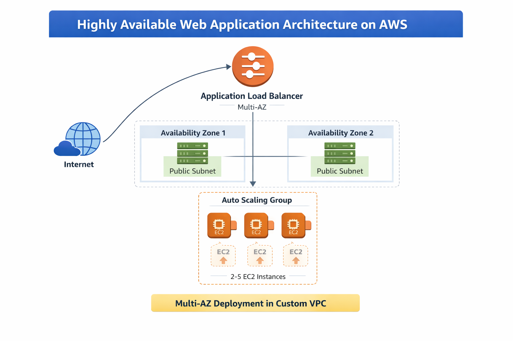
---

##  Architecture Overview:

Internet  
⬇  
Application Load Balancer (Multi-AZ)  
⬇  
Auto Scaling Group (Min: 2 | Max: 5)  
⬇  
EC2 Instances (Nginx Web Server)

---

##  1. Networking Setup:

- Created Custom VPC
- Created 2 Public Subnets in different Availability Zones
- Attached Internet Gateway
- Configured Route Table:
  - `0.0.0.0/0 → Internet Gateway`

#### **Screenshots:**
- vpc structure:
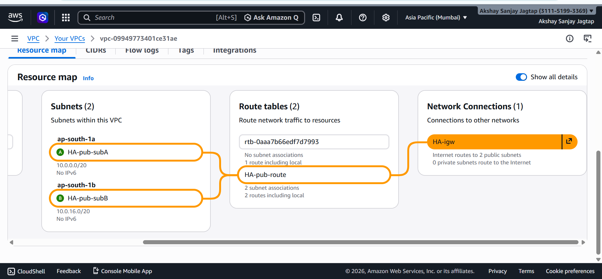

- VPC:
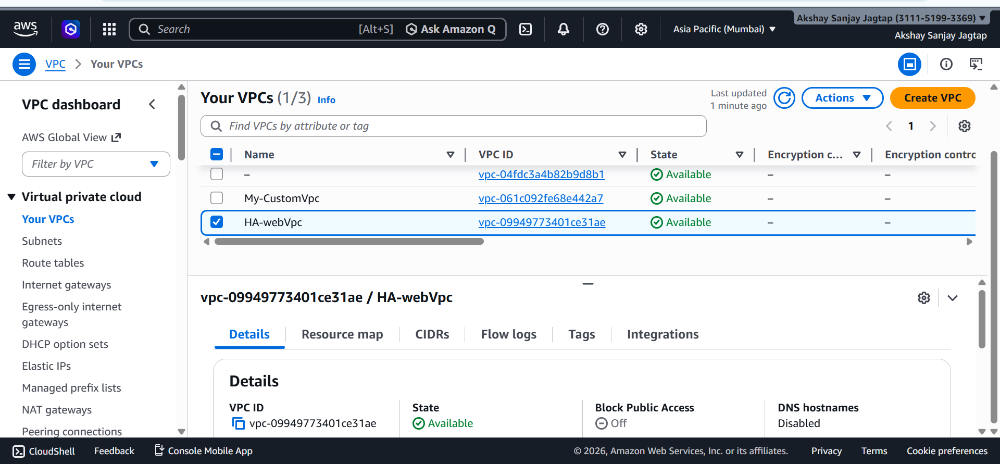

- Subnets:
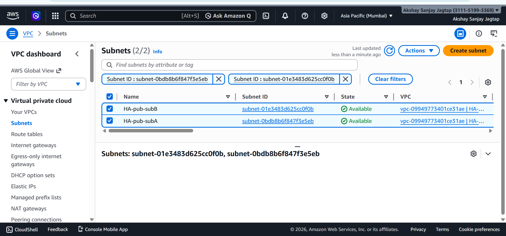

- Subnet Associte:
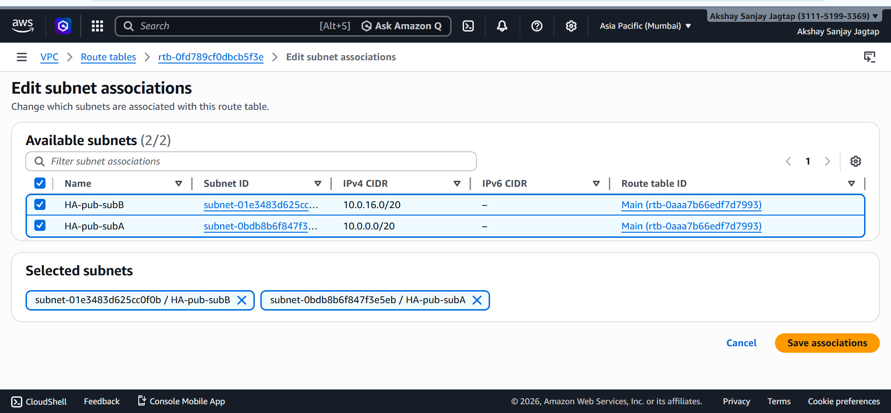

- Route Table
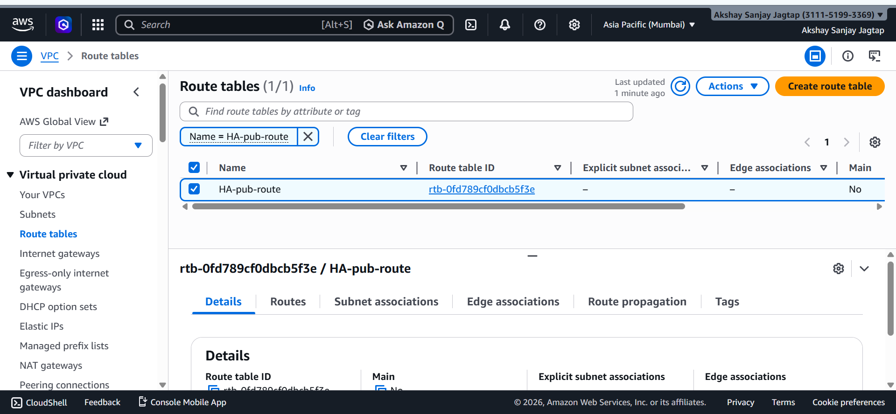

- Route Add:
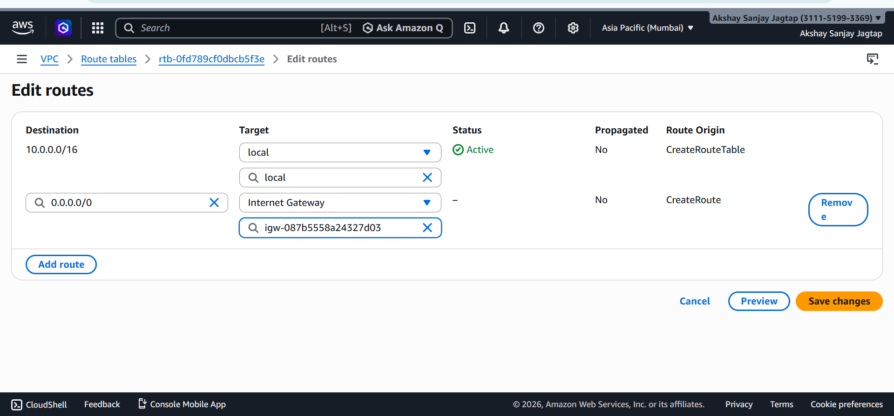

- Internet Gateway:
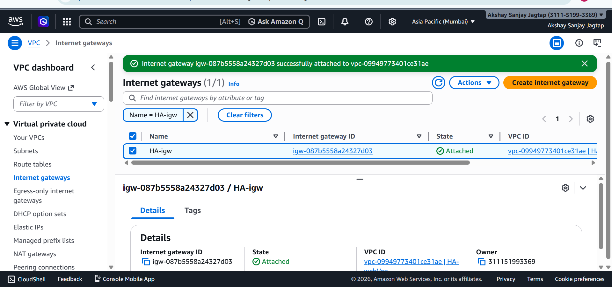

- Internet Gateway Attach:
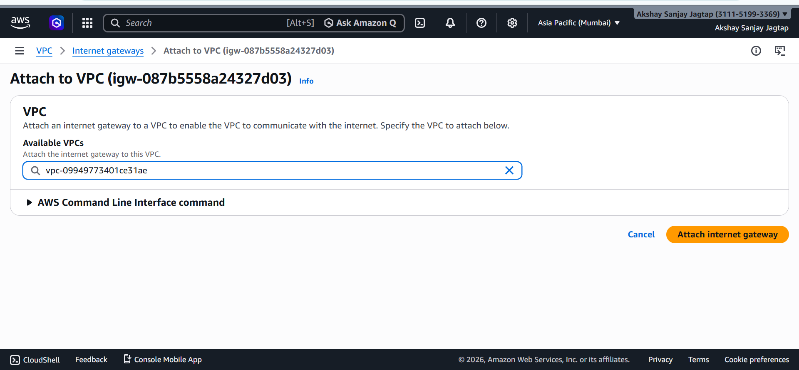
---
## 2. Security Groups:
#### **Screenshots:**

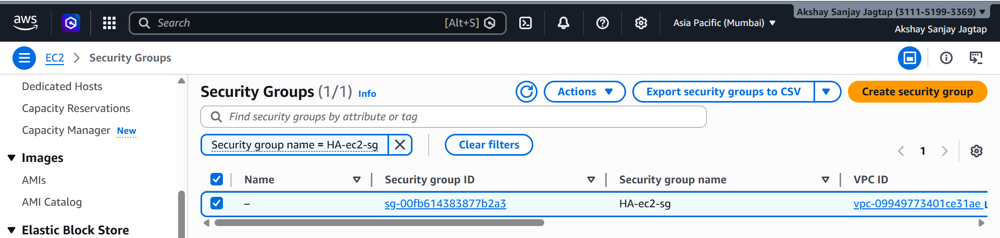
---

## 3. Launch Template Configuration:

- AMI: Amazon Linux 2023
- Instance Type: t2.micro
- Security Group attached
- User Data script to install Nginx
- Custom versioned web page deployed

## User Data Script Used:

```bash
#!/bin/bash
dnf install -y nginx
systemctl enable nginx
systemctl start nginx
echo "<h1>HA App - $(hostname)</h1>" > /usr/share/nginx/html/index.html
```

**Screenshots:**
- Launch Template:
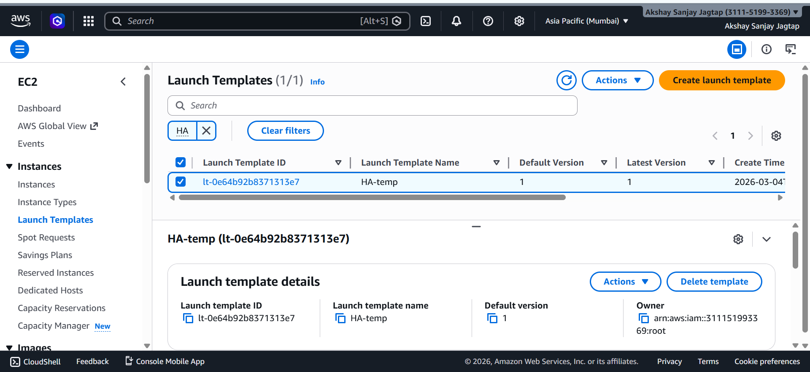

---

##  3️. Auto Scaling Group Configuration:

- Minimum Capacity: 2
- Desired Capacity: 2
- Maximum Capacity: 5
- Multi-AZ subnets selected
- Health Check Type: ELB
- Grace Period: 300 seconds
- Scaling Policy: Target Tracking
- Target CPU Utilization: 50%

**Screenshots:**
- ASG:
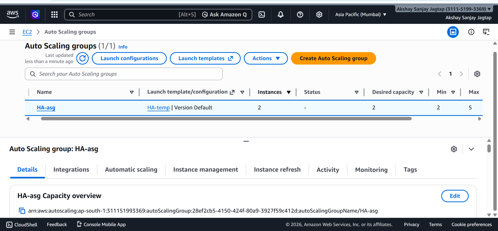
- Scaling policy
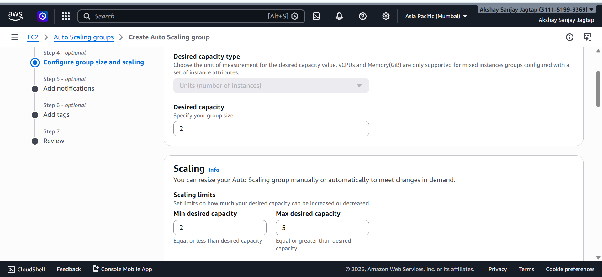

---

##  4️. Application Load Balancer Setup:

- Internet-facing ALB
- Attached to 2 Public Subnets
- Listener: HTTP (Port 80)
- Target Group attached to ASG
- Health Check Path: `/`

**Screenshots:**
- ALB:
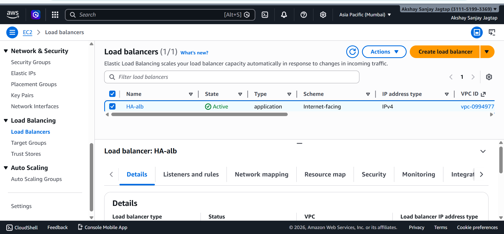
- Target Group
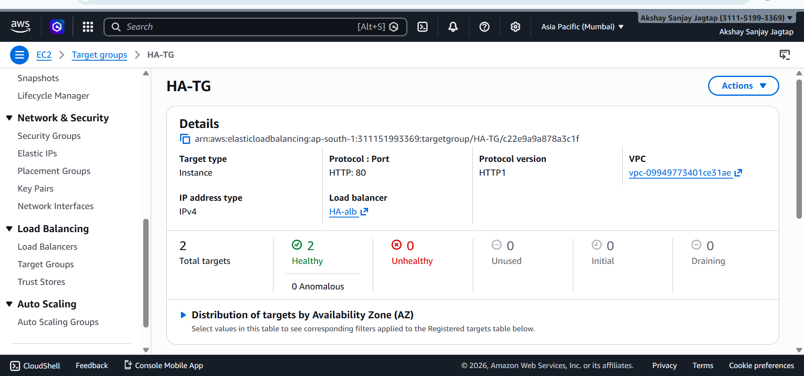

---

##  5️. Scaling Validation:

To test scaling:

1. Connected to EC2 via SSH
2. Installed stress tool
3. Generated CPU load
## install stress:
```bash
dnf install nginx -y
```
## Command Used:

```bash
stress --cpu 8 --timeout 60
```

### Observed:

- CPU spike in CloudWatch
- Auto Scaling triggered new instance launch
- Instance registered in target group
- CloudWatch Alarm changed state

**Screenshots:**
- ASG Activity (Launching new instance)
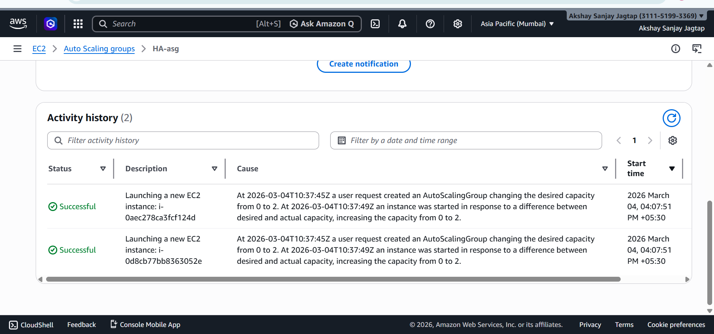
- CloudWatch Alarm (TargetTracking-HA-asg-AlarmHigh)
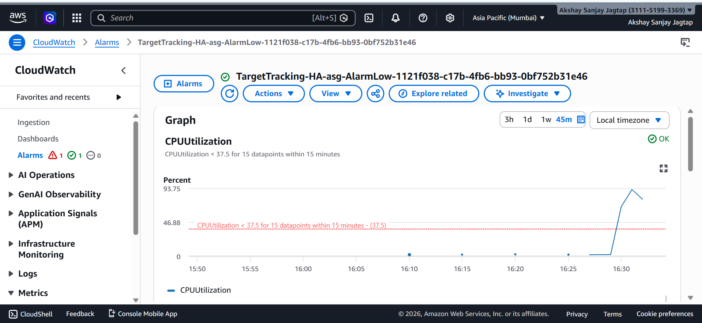

---

##  6️. Failover Testing:

- Manually terminated one EC2 instance
- Auto Scaling launched replacement instance
- Load Balancer continued serving traffic without downtime

**Screenshots:**
- Instance termination:
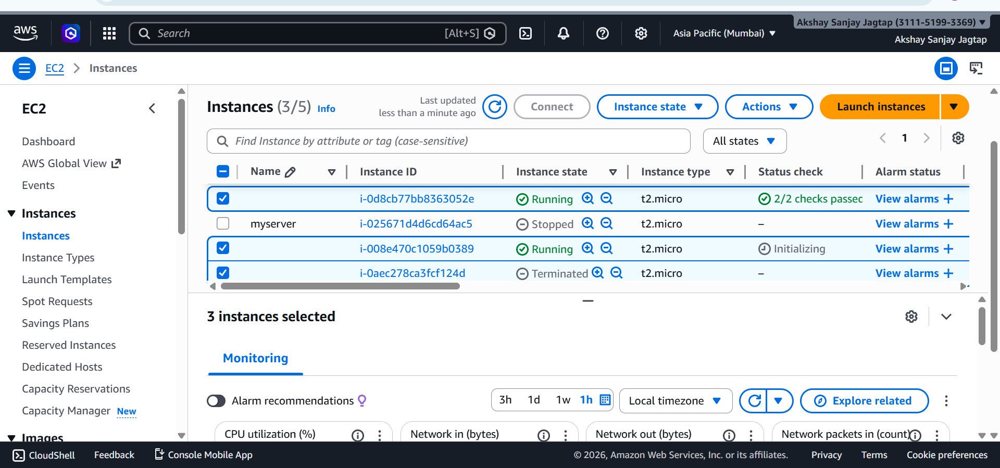

- New instance launch in ASG Activity:
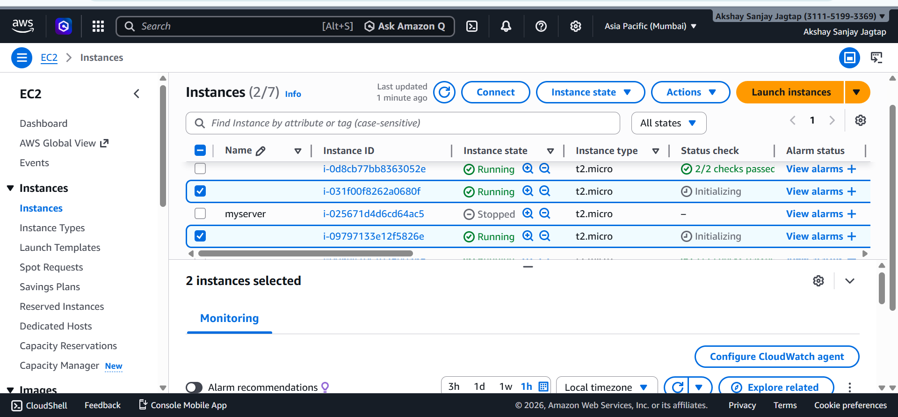
---
##  7. Outputs:
**Screenshots:**

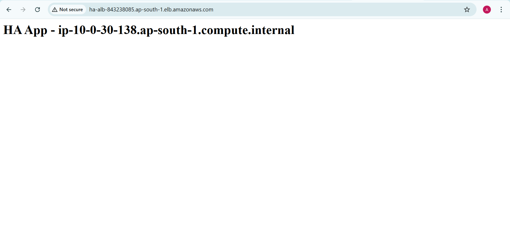

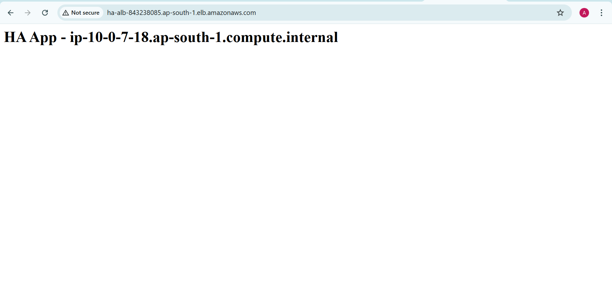
---

##  High Availability Strategy:

This architecture ensures High Availability by:

- Deploying instances across multiple Availability Zones
- Using an Application Load Balancer to distribute traffic
- Automatically replacing unhealthy instances
- Scaling dynamically based on CPU utilization
- Eliminating single points of failure

---

##  Technologies Used:

- Amazon EC2
- Auto Scaling Group
- Application Load Balancer
- CloudWatch

---

## Key Outcomes:

- Zero single point of failure
- Automatic scaling during traffic spikes
- Self-healing infrastructure
- Multi-AZ redundancy
- Improved application reliability

---

##  Conclusion:

This project demonstrates how to build a production-ready, highly available and scalable web application architecture on AWS.  
The system automatically adjusts to traffic demand while ensuring reliability, performance, and fault tolerance.

---
### Author:
#### Akshay Jagtap
---